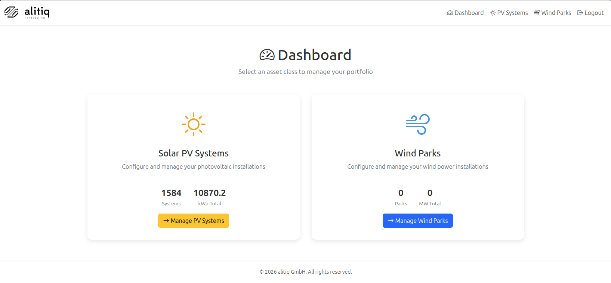
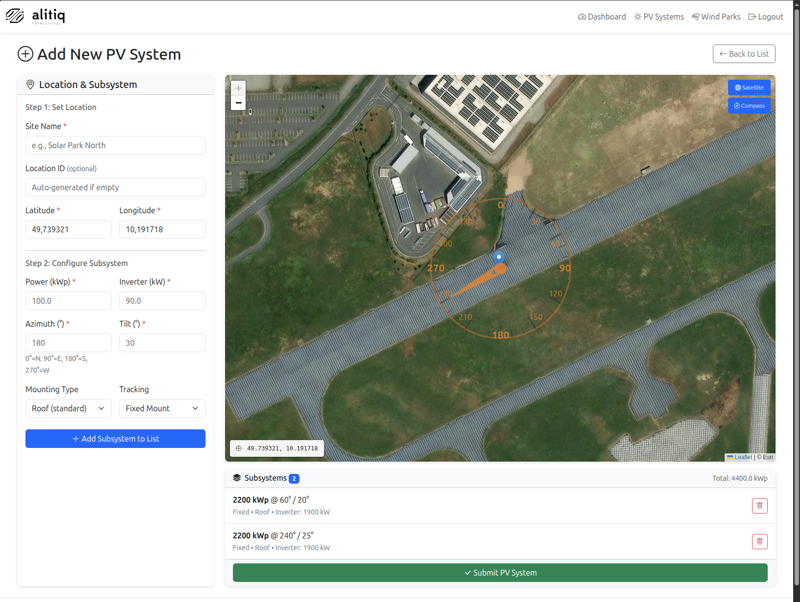

# Portfolio management now lives in the API GUI

We have stopped the standalone solar app.
From now on, portfolio management is available directly in the API GUI:

- [https://api.alitiq.com/gui](https://api.alitiq.com/gui)
- Authentication is done with your personal `x-api-key`
- You can configure and maintain both Solar PV and Wind portfolios

For Solar PV, the GUI includes a dedicated panel to add new systems quickly:

All API endpoints remain available, so you can keep your existing automations while using the GUI for daily portfolio operations.
