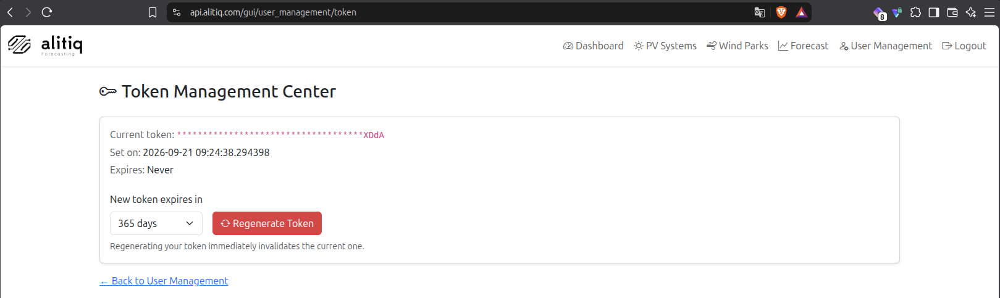
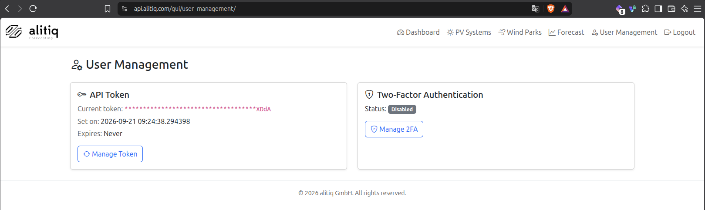

# New in the API GUI: Token Management Center & optional Two-Factor Authentication

We've added a new **User Management** section to the API GUI, giving you self-service control over your API token and the option to secure your GUI login with two-factor authentication (2FA).

<!-- more -->

## Token Management Center 🔑

Head to **[https://api.alitiq.com/gui/user_management/token](https://api.alitiq.com/gui/user_management/token)** (or the new **User Management** link in the navigation bar) to see your current token, when it was last set, and when it expires.

From here you can regenerate your token at any time:

- Pick an expiration for the new token - **30, 90, 180, or 365 days, or Never**.
- Click **Regenerate Token** to issue a brand-new token immediately.
- The new token is shown once, right after generation - make sure to copy it before leaving the page.

Regenerating your token **immediately invalidates the previous one**, so update any scripts or integrations right away.

## Optional Two-Factor Authentication (2FA) 🛡️

The same User Management section now lets you enable TOTP-based two-factor authentication (compatible with apps like Google Authenticator or Authy) for your GUI login:

- Click **Manage 2FA**, then **Set Up 2FA** to get a QR code.
- Scan it with your authenticator app and confirm with the 6-digit code it generates.
- From then on, logging into the API GUI will ask for a fresh code from your app after you enter your `x-api-key`.

2FA is **optional** and only applies to the GUI login - it has no effect on API requests made with your `x-api-key` header, so existing integrations keep working unchanged. You can disable 2FA again at any time from the same page (you'll need to confirm with a current code).

## Expiry reminder emails 📧

If you set your token to expire rather than choosing "Never", we'll now email you automatically when it's about to lapse: a reminder goes out **10 days before expiration**, with a link straight back to the Token Management Center so you can regenerate it in time. Tokens set to "Never" expire won't trigger any reminder.

## Why we built this

Rotating credentials regularly and adding a second factor to your login are two of the simplest ways to keep your account secure. Both are now just a couple of clicks away in the GUI - no need to contact support to get a new token.

Questions or feedback? Reach out to **[support@alitiq.com](mailto:support@alitiq.com)**.
